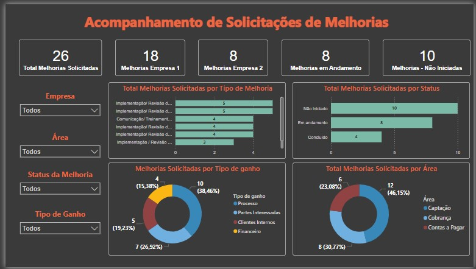

# Dashboard Setor de Melhorias
## 1. Problema de Negócio
O setor de gerenciamento de melhorias da empresa, com foco no gerenciamento e desenvolvimento das solicitações de melhorias da empresa, solicitou um dashboard para acompanhamento de métricas que possam ajuda-los a ter um melhor acompanhamento das solicitações e desenvolvimento de melhorias, auxiliando também na tomada de melhores decisões e estratégias. 
- Algumas das métricas são: Melhorias Solicitadas, Status das melhorias, Áreas, Empresas, Tipo de ganho da melhoria, entre outros.
  - O case do projeto consta na segunda página do dashboard.

## 2. Estratégia da Solução
- Planejada uma análise descritiva como suficiente para atender ao problema de negócio.
- Foi desenvolvido um dashbord agrupando as métricas financeiras da base de dados fornecida pelo setor.

### 2.1 Imagem do Dashboard

## 3. Tecnologias usadas
- **Excel:** Recebimento da base de dados original;
- **Power BI:** Tratamento de dados, construção de tabelas métricas e dashboard.

## 4. Como executar o projeto
- Acesse o arquivo "Projeto_Setor_Melhorias.pbix";
- Utilize os filtros e gráfico interativos para visualização das métricas.

## 5. Top 3 Insights de dados
- Cerca de 46% das melhorias foram concluídas ou estão em andamento (sendo 8 delas ainda em andamento).
  - Sugestão: Realizar uma **análise diganóstica** com dados temporais para estudar a periodicidade com que são solicitadas as melhorias associando com as melhorias no status Em andamento. Isto pode ajudar a equipe a prever períodos em que as áreas solicitam mais melhorias.
- A área que mais solicita melhorias é de Captação, com cerca de 46% das solicitações.
- O setor de Melhorias tem dois projetos atrasados que foram solicitados pela área de Cobrança.

## 6. Próximos Passos
1. Automatização do dashboard após novo recebimento de dados.
2. Realizar uma análise diagnóstica para estudo dos insights sugeridos no item 5 e outras solicitações da equipe de Melhorias.